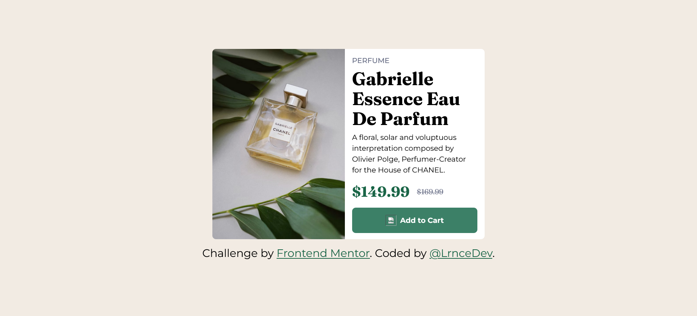

# Frontend Mentor - Product preview card component solution

This is a my solution to the [Product preview card component challenge on Frontend Mentor](https://www.frontendmentor.io/challenges/product-preview-card-component-GO7UmttRfa). 
Frontend Mentor challenges help you improve your coding skills by building realistic projects. 

## Table of contents

- [Overview](#overview)
  - [The challenge](#the-challenge)
  - [Screenshot](#screenshot)
  - [Links](#links)
- [My process](#my-process)
  - [Built with](#built-with)
  - [What I learned](#what-i-learned)
  - [Continued development](#continued-development)
- [Author](#author)

## Overview
The product preview card is a newbie level challenge on Front end mentor. I have been trying to practice my CSS skill to improve the knowledge that i currently have.
### The challenge

Users should be able to:

- View the optimal layout depending on their device's screen size (Breakpoint set on 40em)
- See hover and focus states for interactive elements

### Screenshot

### Links

- Solution URL: (https://github.com/lrncedev/product-preview-card)
- Live Site URL:  (https://lrncedev.github.io/product-preview-card/)

## My process

### Built with

- Semantic HTML5 markup (Almost)
- CSS custom properties
- Flexbox

### What I learned

Learned few techniques in using the Display flex, i struggled on how i can have equal width for both flex items of my card class. 

### Continued development

Would probably make the font-sizes different on each breakpoints.
Will probably also try using Sass for this. Although the project is still very simple IMO.

## Author

- Website - [Laurence Cadag](https://lrncedev.github.io/vueport/)
- Frontend Mentor - [@lrncedev](https://www.frontendmentor.io/profile/@lrncedev)
- Twitter - [@Cadsu3](https://www.twitter.com/@Cadsu3)

